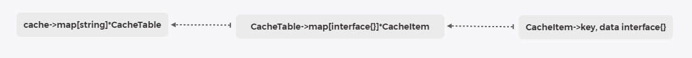

# 源码阅读

[README.md](https://github.com/muesli/cache2go)<br>
Concurrency-safe golang caching library with expiration capabilities.

---

### **相关数据结构**

>
> <h3>Cache</h3>
>
> ```golang
> var (
> 	cache = make(map[string]*CacheTable)
> 	// 使用map关联表名与指向CacheTable的指针
> 	mutex sync.RWMutex
> )
> ```
>
> <h3>CacheTable</h3>
>
> ```go
> type CacheTable struct {
> 	sync.RWMutex
> 
> 	// 缓存项名
> 	name string
> 	// 使用interface{}做键, 值为指向CacheItem的指针
> 	items map[interface{}]*CacheItem
> 
> 	// 定时器触发清除任务
> 	cleanupTimer *time.Timer
> 	// 定时器间隔
> 	cleanupInterval time.Duration
> 
> 	// 该表的log
> 	logger *log.Logger
> 
> 	// 在加载不存在的键时可以触发的回调函数
> 	loadData func(key interface{}, args ...interface{}) *CacheItem
> 	// 添加新的缓存项时的回调函数
> 	addedItem []func(item *CacheItem)
> 	// 缓存中删除缓存项之前触发的回调方法
> 	aboutToDeleteItem []func(item *CacheItem)
> }
> ```
>
> <h3>CacheItemPair</h3>
>
> ```go
> type CacheItemPair struct {
> 	Key         interface{}
> 	AccessCount int64
> }
> ```
>
> <h3>CacheItem</h3>
>
> ```go
> type CacheItem struct {
> 	sync.RWMutex
> 
> 	// 该缓存项的键
> 	key interface{}
> 	// 该缓存项的值
> 	data interface{}
> 	// 当不被访问/保持活动时, 缓存项在缓存中存在多久
> 	lifeSpan time.Duration
> 
> 	// 创建时间戳
> 	createdOn time.Time
> 	// 最后一次访问的时间戳
> 	accessedOn time.Time
> 	// 访问次数
> 	accessCount int64
> 
> 	// 在从缓存中删除缓存项之前触发回调方法
> 	aboutToExpire []func(key interface{})
> }
> ```
><br>

### **API**
1. `func Cache(table string) *CacheTable` 函数根据第一个参数在map中查找该table对应的表指针, 若没有则添加该表, 再返回该指针
2. `func (table *CacheTable) Count() int` 函数返回表中缓存项的数量
3. `func (table *CacheTable) Foreach(trans func(key interface{}, item *CacheItem))` 函数是使用传入的函数处理表中每一个缓存项, 该函数是无返回函数, 参数是table中的items的键与值
4. `func (table *CacheTable) SetDataLoader(f func(interface{}, ...interface{}) *CacheItem)` 函数是设置加载不存在的缓存项时的回调函数
5. `func (table *CacheTable) SetAddedItemCallback(f func(*CacheItem))` 函数重新设置访问缓存项时的回调函数, 会清空之前有的回调函数, 设置完后仅有当前这个回调函数
6. `func (table *CacheTable) AddAddedItemCallback(f func(*CacheItem))` 函数仅添加访问缓存项时的回调函数, 与上面的`SetAddedItemCallback()`不同
7. `func (table *CacheTable) RemoveAddedItemCallbacks()` 函数清空`table.Items`中的所有回调函数, `SetAddedItemCallback()`中就使用了该函数
8. `func (table *CacheTable) SetAboutToDeleteItemCallback(f func(*CacheItem))` 函数重新设置删除缓存项时对应的回调函数, 会清空之前有的回调函数, 设置完后仅有当前这个回调函数
9. `func (table *CacheTable) AddAboutToDeleteItemCallback(f func(*CacheItem))` 函数仅添加删除缓存项时对应的回调函数
10. `func (table *CacheTable) RemoveAboutToDeleteItemCallback()` 函数清空`table.aboutToDeleteItem`中的回调函数, 在`SetAboutToDeleteItemCallback`中使用了该函数
11. `func (table *CacheTable) SetLogger(logger *log.Logger)` 函数设置当前表的log抬头信息
12. `func (table *CacheTable) Add(key interface{}, lifeSpan time.Duration, data interface{}) *CacheItem` 函数初始化一个缓存项, 将其加入表中并刷新计时器
13. `func (table *CacheTable) Delete(key interface{}) (*CacheItem, error)` 函数删除表中以`key`为键的缓存项, 这里的锁有意思
14. `func (table *CacheTable) Exists(key interface{}) bool` 函数判断表中是否存在以`key`为键的缓存项
15. `func (table *CacheTable) NotFoundAdd(key interface{}, lifeSpan time.Duration, data interface{}) bool` 函数判断表中是否存在以`key`为键的缓存项, 存在返回false, 不存在则创建缓存项添加到表中, 返回true
16. `func (table *CacheTable) Value(key interface{}, args ...interface{}) (*CacheItem, error)` 函数访问以`key`为键的缓存项, 存在返回该缓存项, 不存在调用table.loadData()
17. `func (table *CacheTable) Flush()` 函数清除此表中所有缓存项
18. `func (table *CacheTable) MostAccessed(count int64) []*CacheItem` 函数将表中缓存项访问次数为排序条件, 返回最大的count个缓存项
19. `func NewCacheItem(key interface{}, lifeSpan time.Duration, data interface{}) *CacheItem` 函数创建一个CacheItem对象并返回
20. `func (item *CacheItem) KeepAlive()` 函数更新缓存项的访问时间与访问次数
21. `func (item *CacheItem) LifeSpan() time.Duration` 函数返回缓存项的最大存在时长
22. `func (item *CacheItem) AccessedOn() time.Time` 函数返回缓存项的创建时间
23. `func (item *CacheItem) CreatedOn() time.Time` 函数返回缓存项的最后访问时间
24. `func (item *CacheItem) AccessCount() int64` 函数返回缓存项的访问次数
25. `func (item *CacheItem) Key() interface{}` 函数返回缓存项的`key`
26. `func (item *CacheItem) Data() interface{}` 函数返回缓存项的`data`
27. `func (item *CacheItem) SetAboutToExpireCallback(f func(interface{}))` 函数重新设置缓存项被删除时的回调函数
28. `func (item *CacheItem) AddAboutToExpireCallback(f func(interface{}))` 函数添加缓存项被删除时的回调函数
29. `func (item *CacheItem) RemoveAboutToExpireCallback()` 函数清空缓存项被删除时的回调函数

### **重点**
该库的关键点存在于`cachetable.go`中的`func (table *CacheTable) expirationCheck()`函数中, 表的定时器到了触发该函数, 在里面删除某些缓存项, 更新定时器间隔, 刷新定时器<br>
里面的代码不难看懂, 可以去看一下

### **使用**
- [短链接服务](https://github.com/iccy-code/Short-link)